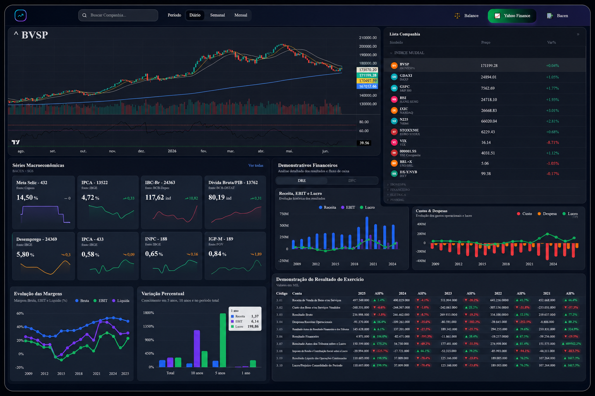

**Finance Dashboard**

Visão geral do painel financeiro que agrega cotações, séries do BACEN e demonstrações (DRE/DFC) extraídas de dados públicos (CVM, Yahoo Finance e BACEN).



**Recursos**
- Visualização de séries do BACEN (consulta por código de série).
- Cotações históricas via Yahoo Finance (rota `/api/price-finance`).
- Visualização de Demonstrativos Financeiros (DRE, DFC) consultando um banco SQLite local.
- Scripts Python para extrair e preparar dados da CVM (`py/` e `python/`).

**Tecnologias**
- Next.js 13+ (app router)
- React 19
- Tailwind CSS + shadcn/ui
- SQLite (arquivo: `db/balanco_cvm.db`)
- Node.js + TypeScript
- Python (scripts de extração / processamento em `py/`)

**Estrutura principal**
- `app/` — Páginas e rotas do Next.js (ex.: rotas API em `app/api/*`).
- `components/` — Componentes de UI e charts.
- `lib/` — Helpers e integrações (ex.: `lib/bacen-api.ts`, `lib/sqlite.ts`).
- `db/` — Banco SQLite usado pelo backend (`balanco_cvm.db`).
- `py/`, `python/` — Scripts e notebooks para extrair e preparar dados da CVM/Bacen.

**Rotas API importantes**
- `GET /api/price-finance?symbol=...&interval=...&range=...` — Busca candles no Yahoo Finance.
- `GET /api/bacen?code=...&start=DD/MM/YYYY&end=DD/MM/YYYY` — Busca séries do BACEN via `lib/bacen-api.ts`.
- `GET /api/balance/company` — Lista empresas presentes no banco (DRE/DFC/BPA/BPP).
- `GET /api/balance/dre?DENOM_CIA=...&GRUPO_DFP=IND|CON&PERIODO=AA|1T|...` — Retorna DRE filtrado.
- `GET /api/balance/dfc?DENOM_CIA=...&GRUPO_DFP=IND|CON&PERIODO=AA|1T|...` — Retorna DFC filtrado.

**Como rodar (desenvolvimento)**
1. Instale dependências:

```bash
npm install
```

2. Rodar em modo dev:

```bash
npm run dev
```

3. Acesse http://localhost:3000 (o `app/page.tsx` redireciona para `/page/balance`).

**Observações sobre dados**
- O backend usa o arquivo SQLite `db/balanco_cvm.db` — gerado pelos scripts Python em `py/`.
- Scripts úteis:
	- `py/extrair.py` — baixa e extrai arquivos ZIP da CVM.
	- `py/dados.py` — processa CSVs e popula `balanco_cvm.db`.

**Deploy / Produção**

```bash
npm run build
npm run start
```

Verifique permissões de leitura para `db/balanco_cvm.db` e variáveis de ambiente (se adicionar credenciais).

**Contribuições**
- Abra uma issue ou um PR com melhorias. Sugestões: testes, tipos mais restritos, paginação nas APIs, e caching adicional.

---

Se quiser, eu adapto o README com exemplos de requests (curl), documentação automática das APIs, ou adiciono um badge de status/CI.

